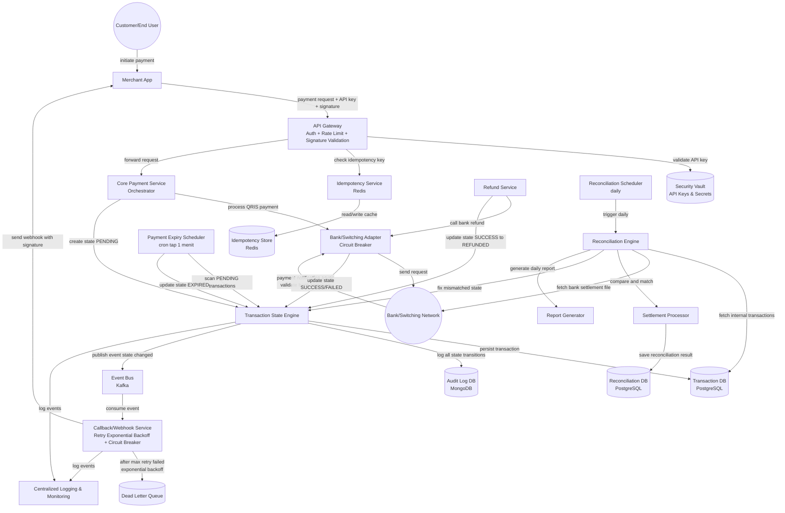
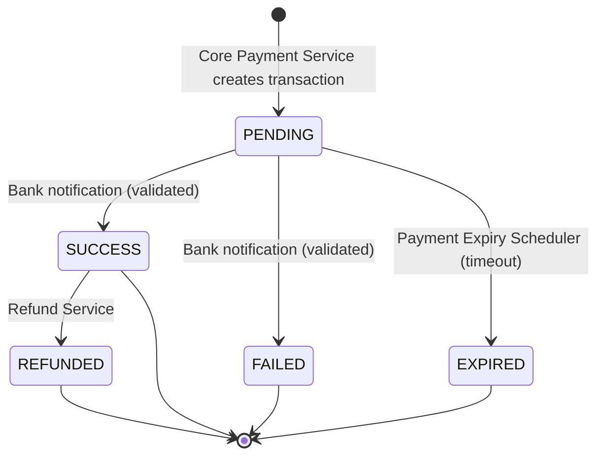

# ARCHITECTURE.md — SinarPay Payment Gateway

## 1. Overview

SinarPay adalah Payment Engine yang menerima pembayaran QRIS dari Merchant, memprosesnya melalui Bank/Switching, meneruskan hasil pembayaran ke Merchant lewat webhook, serta mendukung reconciliation harian terhadap settlement file dari bank. Dokumen ini menjelaskan komponen, alur data, state transaksi, strategi resiliency, dan keamanan sistem.

Diagram sumber: [SinarPay — Miro Board](https://miro.com/app/board/uXjVHwWnV_A=/?share_link_id=847784442715)

## 2. High-Level Architecture

### 2.1 Pemisahan Service

| Service | Tanggung Jawab |
|---|---|
| **API Gateway** | Entry point tunggal dari Merchant App. Menangani auth, rate limit, dan signature validation sebelum request diteruskan ke internal service. |
| **Security Vault** | Penyimpanan API key & secret milik merchant, digunakan API Gateway untuk validasi. |
| **Idempotency Service** | Mengecek dan mencatat idempotency key di Redis sebelum request diproses lebih lanjut, mencegah proses ganda. |
| **Core Payment Service (Orchestrator)** | Mengorkestrasi pembuatan transaksi baru — memicu Transaction State Engine untuk membuat state `PENDING` dan memanggil Bank/Switching Adapter untuk generate QRIS. |
| **Bank/Switching Adapter** | Lapisan integrasi ke Bank/Switching Network, dilindungi Circuit Breaker. Menangani proses QRIS payment (outbound) dan menerima payment notification (inbound), termasuk validasi signature bank. |
| **Transaction State Engine** | Single source of truth untuk seluruh transisi status transaksi. Semua service lain (Core Payment, Bank Adapter, Refund Service, Payment Expiry Scheduler, Reconciliation Engine) mengubah status transaksi HANYA lewat service ini. |
| **Event Bus (Kafka)** | Menerima event `state changed` dari Transaction State Engine dan mendistribusikannya secara asynchronous ke consumer, utamanya Callback/Webhook Service. |
| **Callback/Webhook Service** | Consumer dari Event Bus. Mengirim webhook bersignature ke Merchant App, dilindungi Retry Exponential Backoff + Circuit Breaker. Event yang gagal setelah retry maksimum masuk ke Dead Letter Queue. |
| **Refund Service** | Menangani proses refund — memanggil Bank/Switching Adapter untuk refund ke bank, lalu update state transaksi dari `SUCCESS` ke `REFUNDED` via Transaction State Engine. |
| **Payment Expiry Scheduler** | Cron job (setiap 1 menit) yang memindai transaksi berstatus `PENDING` yang telah melewati batas waktu, lalu mengubah statusnya menjadi `EXPIRED`. |
| **Reconciliation Scheduler** | Cron job harian yang memicu Reconciliation Engine. |
| **Reconciliation Engine** | Mengambil data transaksi internal dari Transaction DB dan settlement file dari bank, membandingkan (compare and match) melalui Settlement Processor, memperbaiki state yang mismatch lewat Transaction State Engine, dan memicu Report Generator. |
| **Settlement Processor** | Melakukan pencocokan detail transaksi vs settlement file, menyimpan hasil ke Reconciliation DB. |
| **Report Generator** | Menghasilkan laporan reconciliation harian. |
| **Centralized Logging & Monitoring** | Menerima log dari seluruh service untuk observability. |

### 2.2 Diagram Komponen

## 3. API & Data Flow

### 3.1 Synchronous — Payment Request

1. Customer memicu pembayaran di Merchant App.
2. Merchant App → **API Gateway**: `POST /v1/payments` dengan header API key + signature.
3. API Gateway memvalidasi API key ke **Security Vault**.
4. API Gateway mengecek **Idempotency Service** (baca/tulis ke Redis) — jika idempotency key sudah pernah diproses, response sebelumnya langsung dikembalikan.
5. Request diteruskan ke **Core Payment Service**.
6. Core Payment Service memicu **Transaction State Engine** untuk membuat transaksi baru berstatus `PENDING`, lalu memanggil **Bank/Switching Adapter** untuk memproses QRIS payment.
7. Bank/Switching Adapter mengirim request ke **Bank/Switching Network**, menerima QRIS string, dikembalikan secara synchronous ke Merchant App (target SLA rendah, dalam hitungan detik).

### 3.2 Asynchronous — Callback / Webhook

1. **Bank/Switching Network** mengirim payment notification secara async ke **Bank/Switching Adapter**.
2. Adapter memvalidasi signature dari bank terlebih dahulu — notifikasi tanpa signature valid ditolak dan tidak pernah mengubah state.
3. Setelah tervalidasi, Adapter memanggil **Transaction State Engine** untuk update state menjadi `SUCCESS` atau `FAILED`.
4. Transaction State Engine mempersist perubahan ke **Transaction DB**, mencatat riwayat ke **Audit Log DB**, dan mem-publish event `state changed` ke **Event Bus (Kafka)**.
5. **Callback/Webhook Service** meng-consume event dari Kafka, menandatangani payload, lalu mengirim webhook ke Merchant App.
6. Jika pengiriman gagal, Callback/Webhook Service melakukan retry dengan **exponential backoff**, dilindungi **circuit breaker** agar tidak terus membebani endpoint merchant yang bermasalah.
7. Jika retry mencapai batas maksimum, event dipindahkan ke **Dead Letter Queue** untuk investigasi manual.

### 3.3 Refund Flow

1. **Refund Service** menerima permintaan refund (dipicu dari Merchant Dashboard atau Back-Office).
2. Refund Service memanggil **Bank/Switching Adapter** untuk memproses refund ke bank.
3. Setelah berhasil, Refund Service memanggil **Transaction State Engine** untuk mengubah status dari `SUCCESS` menjadi `REFUNDED`.
4. Perubahan ini memicu event ke Event Bus, sehingga Merchant juga menerima webhook notifikasi refund.

### 3.4 Expiry Flow

1. **Payment Expiry Scheduler** berjalan setiap 1 menit (cron), memindai seluruh transaksi berstatus `PENDING` yang sudah melewati batas waktu QRIS.
2. Untuk setiap transaksi yang kedaluwarsa, scheduler memanggil **Transaction State Engine** untuk update state menjadi `EXPIRED`.

### 3.5 Reconciliation Flow (Harian)

1. **Reconciliation Scheduler** memicu **Reconciliation Engine** setiap hari.
2. Reconciliation Engine mengambil data transaksi internal dari **Transaction DB** dan settlement file dari **Bank/Switching Network**.
3. **Settlement Processor** membandingkan (compare and match) kedua sumber data, menyimpan hasilnya ke **Reconciliation DB**.
4. Jika ditemukan mismatch (misal status internal `PENDING` tapi bank sudah settle), Reconciliation Engine memperbaikinya lewat **Transaction State Engine**.
5. **Report Generator** menghasilkan laporan reconciliation harian dari hasil di atas.

## 4. Database & Transaction State

### 4.1 Data Store yang Digunakan

| Store | Teknologi | Digunakan Oleh | Alasan Pemilihan |
|---|---|---|---|
| Transaction DB | PostgreSQL | Transaction State Engine, Reconciliation Engine | Data transaksi bersifat relasional dan butuh strong consistency/ACID untuk state transaksi finansial. |
| Reconciliation DB | PostgreSQL | Settlement Processor | Hasil pencocokan reconciliation juga relasional, terhubung ke data transaksi. |
| Audit Log DB | MongoDB | Transaction State Engine | Log bersifat append-only dengan struktur fleksibel per jenis event, cocok dengan model dokumen. |
| Idempotency Store | Redis | Idempotency Service | Butuh akses baca/tulis sangat cepat dengan TTL otomatis untuk key yang sudah kedaluwarsa. |

### 4.2 State Transaksi

Status transaksi yang digunakan: **`PENDING` → `SUCCESS` | `FAILED` | `EXPIRED`**, dan **`SUCCESS` → `REFUNDED`**.

> Catatan penamaan: brief menyebut dua variasi penamaan status (`ISSUED/PAID/EXPIRED/CANCELLED` di deliverable teknis, `PENDING/SUCCESS/FAILED/EXPIRED/REFUNDED` di studi kasus arsitektur). Implementasi SinarPay mengikuti penamaan kedua (`PENDING/SUCCESS/FAILED/EXPIRED/REFUNDED`) karena inilah yang digunakan konsisten di desain arsitektur ini. Jika project deliverable teknis mewajibkan penamaan `ISSUED/PAID/EXPIRED/CANCELLED`, perlakukan sebagai alias satu-ke-satu: `ISSUED`≈`PENDING`, `PAID`≈`SUCCESS`, `CANCELLED`≈`FAILED`.

Aturan:
- Seluruh transisi status HANYA boleh terjadi lewat **Transaction State Engine** — service lain tidak pernah mengubah kolom `status` secara langsung.
- Setiap transisi dicatat ke Audit Log DB (`log all state transitions`), termasuk aktor pemicunya (Bank Adapter, Refund Service, Expiry Scheduler, atau Reconciliation Engine).
- Transisi ilegal (misal `EXPIRED` → `SUCCESS` tanpa lewat mekanisme reconciliation) ditolak oleh Transaction State Engine.
- Reconciliation Engine adalah satu-satunya pihak yang boleh "memperbaiki" state yang sudah final berdasarkan bukti settlement file — ini ditangani sebagai jalur khusus (`fix mismatched state`), bukan transisi normal dari flow real-time.

## 5. Resiliency

| Strategi | Implementasi |
|---|---|
| **Message Queue** | Kafka sebagai Event Bus, memisahkan Transaction State Engine dari Callback/Webhook Service. Event `state changed` tetap tersimpan di Kafka meski Callback Service atau Merchant sedang down. |
| **Retry Mechanism** | Callback/Webhook Service menerapkan retry dengan **exponential backoff** untuk setiap pengiriman webhook yang gagal (mis. jeda 5s → 15s → 1m → 5m → 30m). |
| **Circuit Breaker** | Dipasang di dua titik panggilan keluar yang rawan gagal berulang: **Bank/Switching Adapter** (panggilan ke Bank/Switching Network) dan **Callback/Webhook Service** (panggilan ke Merchant App). Saat error rate melewati threshold, circuit "open" sementara untuk mencegah pembebanan berlebih ke sistem yang bermasalah, lalu dicoba lagi setelah cooldown (half-open). |
| **Dead Letter Queue** | Menampung event webhook yang gagal terkirim setelah retry mencapai batas maksimum, untuk investigasi dan replay manual. |
| **Idempotency** | Mencegah duplikasi transaksi akibat network retry dari sisi Merchant (lihat section 6). |

## 6. Security & Idempotency

- **API Key Protection**: API key & secret merchant disimpan di **Security Vault**, divalidasi oleh API Gateway pada setiap request masuk.
- **Signature Validation (Outbound)**: setiap webhook yang dikirim ke Merchant App ditandatangani (HMAC) sehingga Merchant dapat memverifikasi keasliannya.
- **Signature Validation (Inbound)**: setiap payment notification dari Bank/Switching Network divalidasi signature-nya oleh Bank/Switching Adapter **sebelum** memicu perubahan state — mencegah notifikasi palsu mengubah status transaksi.
- **Idempotency Storage**: Idempotency Service menggunakan Redis untuk menyimpan idempotency key dari setiap payment request. Request dengan key yang sama dalam periode TTL tertentu tidak diproses ulang, cukup dikembalikan response yang tersimpan.
- **Rate Limiting**: diterapkan di level API Gateway bersamaan dengan auth & signature validation.
- **Audit Trail**: seluruh transisi status dan tindakan sensitif (refund, override state oleh reconciliation) dicatat ke Audit Log DB (MongoDB) melalui Transaction State Engine.
- **Centralized Logging & Monitoring**: seluruh service (Transaction State Engine, Callback/Webhook Service) mengirim log operasional ke satu titik observability terpusat.

## 7. Ringkasan Teknologi

| Kategori | Pilihan |
|---|---|
| Message Broker / Event Bus | Kafka |
| Idempotency Store | Redis |
| Transaction & Reconciliation DB | PostgreSQL |
| Audit Log DB | MongoDB |
| Resiliency Pattern | Retry + Exponential Backoff, Circuit Breaker, Dead Letter Queue |
| Security | API Key + Secret (Security Vault), HMAC Signature (inbound & outbound), Redis-based Idempotency |
